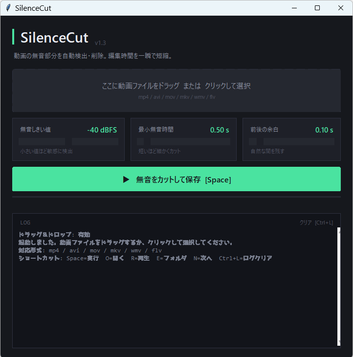

# SilenceCut

動画の無音部分を自動で検出してカットするWindowsツールです。  
動画編集の時短をしたい人向けに作りました。

## 🎥 開発動画（YouTube）
https://www.youtube.com/watch?v=wx--EvrOP3M

## 🎁 EXE版ダウンロードはこちら（note）
https://note.com/ai_app_kobo/n/n76e913eeb3d3

## 🚀 使い方
1. EXEを起動
2. 動画ファイルを選択
3. 無音設定を調整
4. 開始ボタンを押す
